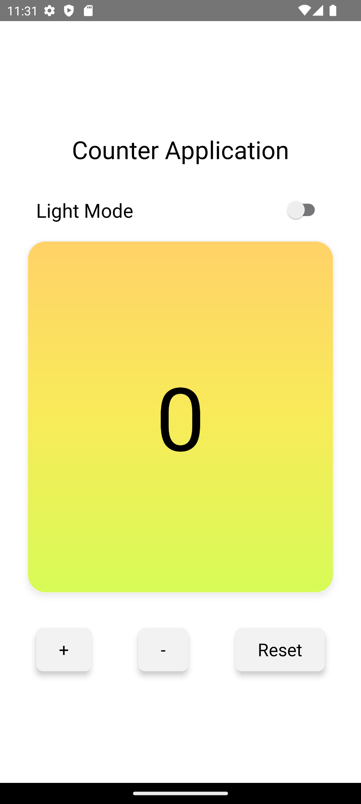
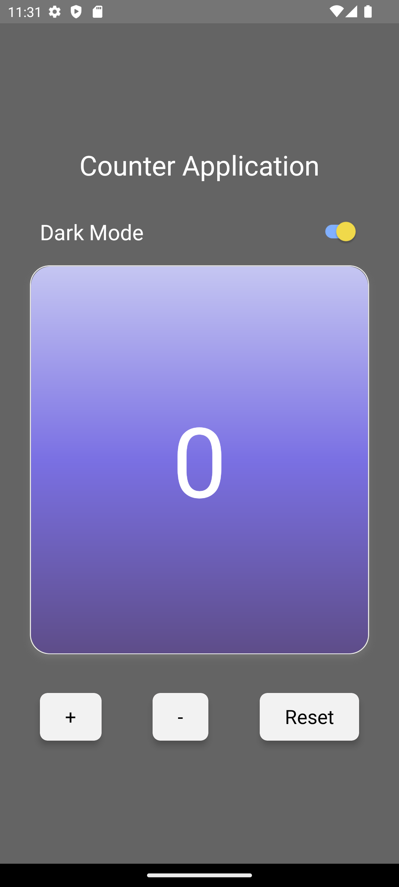

📱 Counter App

A simple React Native application that demonstrates core React concepts like state management, props, component re-rendering, and persistent storage using AsyncStorage.

This project focuses on strengthening fundamentals by building a clean, component-based counter UI with theme persistence.

✨ Features

* Increment counter
* Decrement counter
* Reset counter
* Dark / Light theme toggle
* Persist theme using AsyncStorage
* Reusable button component
* Clean and minimal UI
* Component-based architecture

🧠 Concepts Covered

* useState for state management
* Props & unidirectional data flow
* Component re-rendering
* Props & unidirectional data flow
* Component re-rendering
* Event handling
* Event handling
* AsyncStorage (getItem, setItem, removeItem)
* JSON.stringify & JSON.parse
* Data persistence across app reload
* StyleSheet vs inline styling

Component separation and reusability

🏗️ Project Structure
src/
 ├── screens/
 │     └── HomeScreen.tsx
 ├── components/
 │     ├── CounterCard.tsx
 │     └── CounterButton.tsx
 └── utils/
       └── storage.ts

🚀 How It Works

* The count state is managed in HomeScreen.
* CounterCard receives the count value via props.
* CounterButton receives handler functions via props.
* Theme preference is stored using AsyncStorage.
* When the app loads, useEffect retrieves the saved theme from storage.
* React Native automatically re-renders components when state changes.
* This demonstrates React’s unidirectional data flow pattern.

💾 AsyncStorage Implementation

Data is stored as key-value pairs:
* "theme" → boolean (dark/light)
Since AsyncStorage stores only strings:
* Data is converted using JSON.stringify()
* Parsed back using JSON.parse()

## 📱 App Preview

